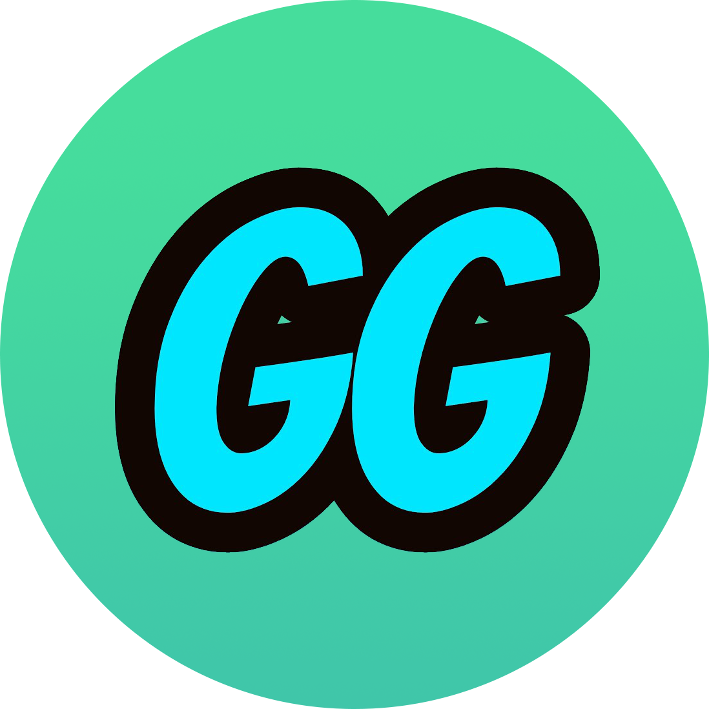

    
    <h2 align="center">GGsBot</h2>
    
GGsBot is a <strong>multi-purpose</strong>, <strong>highly customizable</strong> discord bot powered by artificial intelligence

    

        
        
        
    

    <!--
    

        <a href="">Link</a>
        ·
        <a href="">Link</a>
    

    -->

>[!WARNING]
> GGsBot is still in its early stages, and there are some features that have not been implemented yet. If you find any issues or need further assistance, feel free to contact me or join the Discord server.

## Index
- [Index](#index)
- [Nextcord Wrapper Library](#nextcord-wrapper-library)
- [Slash Commands Approach](#slash-commands-approach)
- [Cogs Structure](#cogs-structure)
- [SQLite Database](#sqlite-database)
- [HTTP Web Server](#http-web-server)
- [Logging System](#logging-system)
- [Extensions](#extensions)
  - [Commands Manager](#commands-manager)
  - [Automatic Greetings Messages](#automatic-greetings-messages)
  - [Automatic Guild Metadata Update](#automatic-guild-metadata-update)
  - [Automatic Activity \& Status Update](#automatic-activity--status-update)
  - [Generic Moderation Commands](#generic-moderation-commands)
  - [Temporary Voice Channels](#temporary-voice-channels)
  - [Staff Management](#staff-management)
  - [Ai Image Generation](#ai-image-generation)
  - [Ai Summarizer](#ai-summarizer)
  - [Ai Translator](#ai-translator)
  - [Ai ChatBot](#ai-chatbot)
  - [Valorant Quiz](#valorant-quiz)
  - [Verification](#verification)
  - [Music](#music)
- [Installation](#installation)
- [💖 Support the project](#-support-the-project)

## Nextcord Wrapper Library
I chose to use the [**Nextcord**](https://github.com/nextcord/nextcord) wrapper as the foundation of my bot because it offers a unique combination of features that align with my project's goals. Specifically:
- **Robust API**: Nextcord provides an extensive and well-documented API that makes it easy to interact with the Discord platform.
- **Async-friendly**: Asynchronous programming is essential for building efficient and scalable bots, and Nextcord has excellent support for async/await syntax.
- **Flexible architecture**: The library allows me to structure my code in a modular way, making it easier to maintain and extend the bot's functionality.
- **Constantly improving**: The Nextcord community is active and committed to continuous improvement, ensuring that I can leverage the latest features and best practices.

<a href="#index" >Back to Index</a>

## Slash Commands Approach
In addition to using Nextcord as my bot's foundation, I've also adopted the Slash Command approach to provide users with an intuitive and user-friendly way of interacting this bot. Specifically:

- **Simple and consistent API**: Slash commands offer a simple and consistent API for users to interact with slash commands, making it easy for them to discover and use the features they need.
- **Improved discoverability**: Slash commands also make it easier for users to discover new features and commands, by presenting them in a clear and organized way.

By using the Slash Command approach, I'm able to provide my users with a seamless and enjoyable experience when interacting with my bot.

<a href="#index" >Back to Index</a>

## Cogs Structure
GGsBot's command structure is organized into Cogs, which are modular and self-contained modules that provide specific functionality. Each Cog represents a distinct area of responsibility, such as music, games, guild, and so on.

By using this Cog-based approach, GGsBot's commands are easy to find, use, and maintain. This structure allows for:
- **Modularity**: Each Cog is independent and can be updated or modified without affecting the rest of the code.
- **Extensibility**: New Cogs can be added as needed, expanding the bot's capabilities and features.
- **Reusability**: Cogs can be reused across multiple commands, reducing code duplication and improving maintainability.

<a href="#index" >Back to Index</a>

## SQLite Database
GGsBot relies on a **SQLite Database** to store and manage its data. This database is designed to provide a robust and efficient way of storing and retrieving data, while also being easy to use and maintain.

The SQLite Database is structured into several tables, each with its own specific purpose:
- **guilds**: Stores information about the guilds (servers) that GGsBot is part of.
- **users**: Contains user-specific data, such as their ID, name, and preferences.
- **extensions**: Lists all installed extensions and commands with their configurations.

The SQLite Database is used to:

- **Store persistent data**: GGsBot's database provides a reliable way of storing data that needs to be preserved even after the bot restarts or crashes.

- **Speed up queries**: The database is optimized for fast query execution, ensuring that commands are executed quickly and efficiently.

- **Improve performance**: By reducing the load on the bot's memory and CPU, the SQLite Database helps maintain GGsBot's overall performance.

GGsBot's SQLite Database is designed to be robust, scalable, and easy to use, allowing the bot to focus on providing a great user experience.

<a href="#index" >Back to Index</a>

## HTTP Web Server
The HTTP Web Server is currently in its initial state, but has great potential to become a powerful tool for hosting documentation, displaying status updates, and providing APIs. 
As it stands, this feature allows users to access information about the bot, including its status, configuration, and usage statistics.

> [!NOTE]
> The HTTP Web Server is still in development and it has only the basic structure

In the future, this feature could be used to
- **Host documentation** for the bot's commands, features, and APIs
- Display **real-time status updates** for the bot, including server uptime and performance metrics
- **Provide a RESTful API** for developers to access and manipulate data related to the bot

While the HTTP Web Server is still in its early stages, it has the potential to become a valuable resource for users and developers alike. As it continues to evolve, you can expect to see more features and improvements added to make it an essential part of the GGsBot ecosystem.

<a href="#index" >Back to Index</a>

## Logging System
GGsBot relies on a Logging System to track and record important events, such as command executions, errors, and other significant occurrences. 

This system is built using Python's built-in **Logger** library, which provides a robust and customizable way of logging events.

The Logging System is used to:

- **Track important events**: GGsBot's logging system tracks and records significant events, such as command executions, errors, and other important occurrences.
- **Improve debugging**: The logging system provides detailed information about what happened when an error occurred, making it easier to debug issues.
- **Monitor performance**: By tracking key metrics and events, the logging system helps monitor GGsBot's performance and identify areas for improvement.

GGsBot's Logging System is designed to be flexible, customizable, and easy to use, allowing developers to quickly and effectively track and analyze important events.

<a href="#index" >Back to Index</a>

## Extensions
GGsBot is designed to be **highly extensible**, with multiple Extensions that provide additional functionality and features. These extensions are modular and self-contained, allowing them to be easily added or removed as needed.

These extensions are designed to be:

- **Modular**: Each extension is a self-contained module that can be added or removed independently.
- **Reusable**: Extensions can be reused across multiple commands and features.
- **Extensible**: New extensions can be easily added to expand the bot's capabilities.

By providing a range of extensions, GGsBot is able to offer a wide range of features and functionality, making it an extremely versatile and powerful Discord bot.

Some of the key extensions in GGsBot include:

<a href="#index" >Back to Index</a>

### Commands Manager
The Commands Manager is a basic extension of GGsBot that provides a comprehensive set of commands for managing extensions

<a href="#index" >Back to Index</a>

### Automatic Greetings Messages
*`work in progress...`*

<a href="#index" >Back to Index</a>

### Automatic Guild Metadata Update
*`work in progress...`*

<a href="#index" >Back to Index</a>

### Automatic Activity & Status Update
*`work in progress...`*

<a href="#index" >Back to Index</a>

### Generic Moderation Commands
*`work in progress...`*

<a href="#index" >Back to Index</a>

### Temporary Voice Channels
*`work in progress...`*

<a href="#index" >Back to Index</a>

### Staff Management
*`work in progress...`*

<a href="#index" >Back to Index</a>

### Ai Image Generation
*`work in progress...`*

<a href="#index" >Back to Index</a>

### Ai Summarizer
*`work in progress...`*

<a href="#index" >Back to Index</a>

### Ai Translator
*`work in progress...`*

<a href="#index" >Back to Index</a>

### Ai ChatBot
*`work in progress...`*

<a href="#index" >Back to Index</a>

### Valorant Quiz
*`work in progress...`*

<a href="#index" >Back to Index</a>

### Verification
*`work in progress...`*

<a href="#index" >Back to Index</a>

### Music
*`work in progress...`*

<a href="#index" >Back to Index</a>

## Installation
*`work in progress...`*

<a href="#index" >Back to Index</a>

## 💖 Support the project
*`work in progress...`*

<a href="#index" >Back to Index</a>

